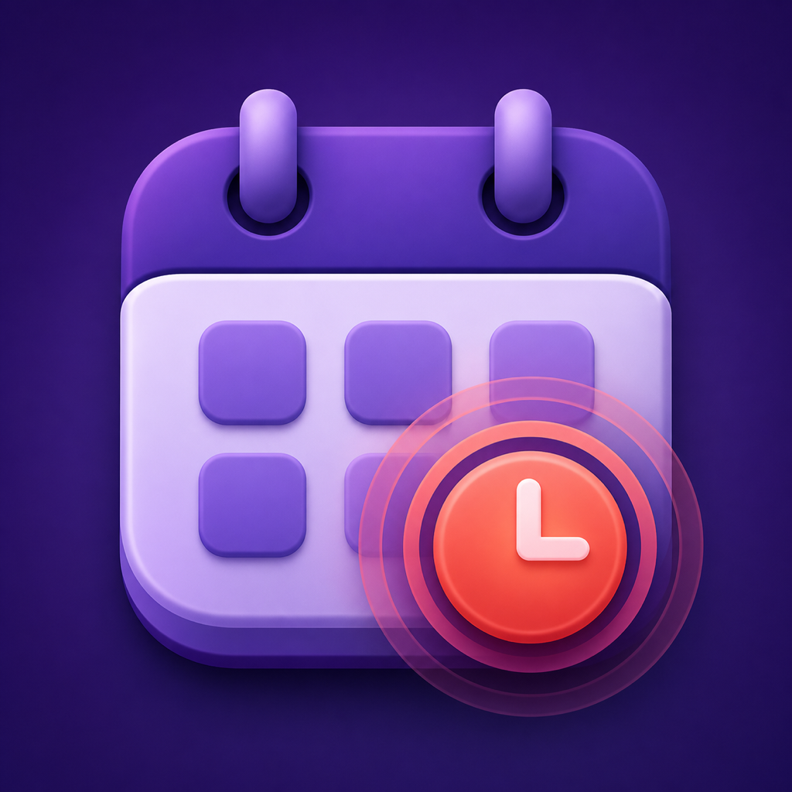

# Heads Up

A local-only macOS menu-bar app that makes meetings difficult to miss.



Heads Up reads Apple Calendar and shows a full-screen **Join**, **Snooze**, or **Skip** alert when a
meeting is about to begin. It supports calendar and attendance filters, recognized video-meeting
links, multiple displays, sound, pause, and launch at login.

## Install

Download `Heads-Up.dmg` from the latest release, open it, and drag Heads Up into Applications.

The current alpha is not signed. The first time you launch it, macOS will block it. After trying to
open it, go to **System Settings → Privacy & Security**, click **Open Anyway**, and confirm. Then
grant Calendar access when Heads Up asks.

## Build

Requires macOS 14 and Xcode or the Xcode Command Line Tools.

```sh
./build.sh
open "build/Heads Up.app"
```

Remote calendars must already be visible in Apple Calendar. Provider-side sync delays therefore
also delay Heads Up.

## Privacy

Calendar data stays on the Mac. Heads Up has no server, analytics, accounts, advertising, or
calendar-write access.

## License

[MIT](LICENSE)
